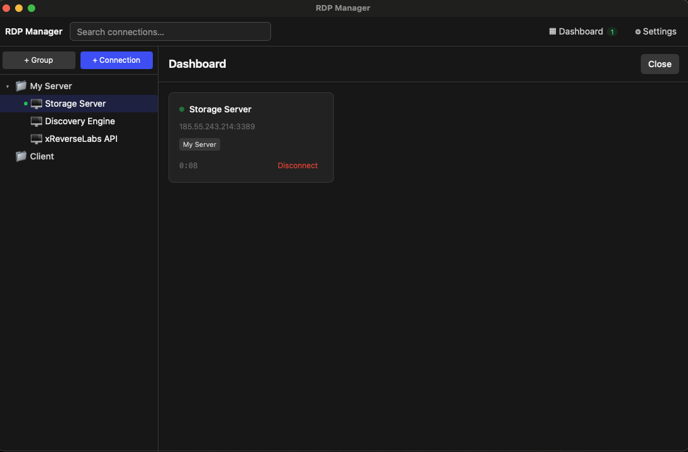
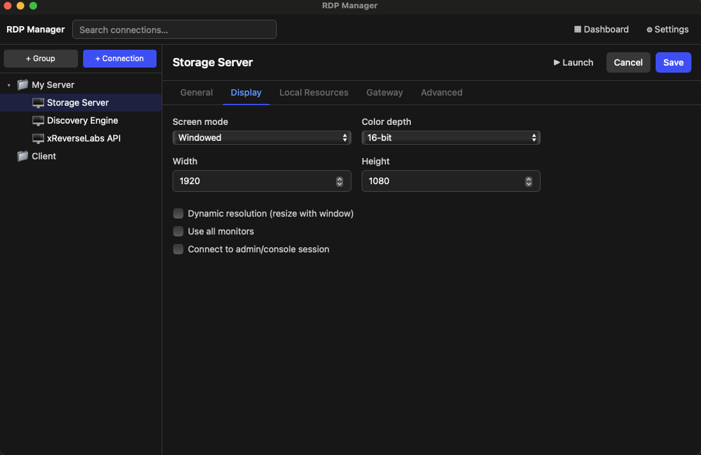

# RDP Manager

A lightweight, cross-platform Remote Desktop connection manager for macOS and Windows. Organize dozens of RDP connections into groups, keep credentials in your OS keychain (never in a database), and launch sessions through your system's native RDP client with clipboard redirection on by default.

[](https://github.com/yon3zu/Rdp-Manager/actions/workflows/build.yml)



## Features

- **Groups & sub-groups** — organize connections in a nested tree, drag-free, built for managing dozens of servers at once
- **Live connection status** — a green indicator shows which connections are currently active, and clears automatically the moment a session disconnects
- **Secure credentials** — passwords are stored in the OS keychain (macOS Keychain / Windows Credential Manager), never written to disk in plaintext
- **Advanced RDP settings per connection** — screen mode & resolution, color depth, multi-monitor, admin/console session, drive/printer/clipboard redirection, audio mode, RD Gateway, certificate trust behavior, connection timeout
- **Native client launch** — no bundled RDP protocol implementation; connections are handed off to `sdl-freerdp`/`xfreerdp` on macOS and `mstsc` on Windows, so clipboard redirection and performance match what you already trust
- **Lightweight** — built with Tauri (Rust + native webview), not Electron; no bundled Chromium

## Screenshots

| Connections & groups | Advanced settings |
| --- | --- |
|  |  |

## Download

Every push to `main` builds signed-for-dev installers via GitHub Actions:

1. Go to the [Actions tab](https://github.com/yon3zu/Rdp-Manager/actions/workflows/build.yml)
2. Open the latest successful run
3. Download `rdp-manager-windows` (`.msi` / `.exe`) or `rdp-manager-macos` (`.dmg` / `.app`) from the **Artifacts** section

> Builds are unsigned during development, so macOS Gatekeeper and Windows SmartScreen will warn on first launch — this is expected until the app is code-signed for a proper release.

## How it works

RDP Manager doesn't implement the RDP protocol itself. It's a connection manager: you fill in a profile (host, credentials, display/gateway/advanced settings), and when you hit **Launch** it hands everything off to your OS's real RDP client:

- **macOS**: `sdl-freerdp` (preferred, no XQuartz needed) or `xfreerdp`, both from [FreeRDP](https://www.freerdp.com/) (`brew install freerdp`)
- **Windows**: the built-in `mstsc.exe`

Clipboard redirection, performance, and protocol compatibility are exactly what those clients already provide — RDP Manager just remembers your servers, your settings, and your credentials so you don't have to.

## Building from source

**Prerequisites:** [Rust](https://rustup.rs/) (stable), [Node.js](https://nodejs.org/) 22+, [pnpm](https://pnpm.io/).
On macOS, also install a native RDP client: `brew install freerdp`.

```bash
git clone https://github.com/yon3zu/Rdp-Manager.git
cd Rdp-Manager
pnpm install
pnpm tauri dev      # run in development
pnpm tauri build    # produce a release installer for your OS
```

Windows and macOS installers are also produced automatically by [`.github/workflows/build.yml`](.github/workflows/build.yml) on every push to `main`.

## Project structure

```
src/                    React + TypeScript frontend
  components/           sidebar (group tree), connection editor tabs, settings
  state/store.ts         Zustand store — all app state lives here
  api/tauri.ts            typed wrappers around Tauri IPC commands

src-tauri/src/          Rust backend
  db/                    SQLite (rusqlite) — groups & connection profiles
  credentials/           OS keychain access (the `keyring` crate)
  rdpfile/                generates .rdp file content (Windows / export)
  launcher/               spawns the native RDP client per platform
  sessions/               tracks active RDP client processes for the live status indicator
  commands/               #[tauri::command] functions exposed to the frontend
```

## Tech stack

[Tauri 2](https://tauri.app/) (Rust) · [React](https://react.dev/) + [TypeScript](https://www.typescriptlang.org/) · [Zustand](https://github.com/pmndrs/zustand) · [Tailwind CSS](https://tailwindcss.com/) · [rusqlite](https://github.com/rusqlite/rusqlite) · [keyring-rs](https://github.com/hwchen/keyring-rs)
